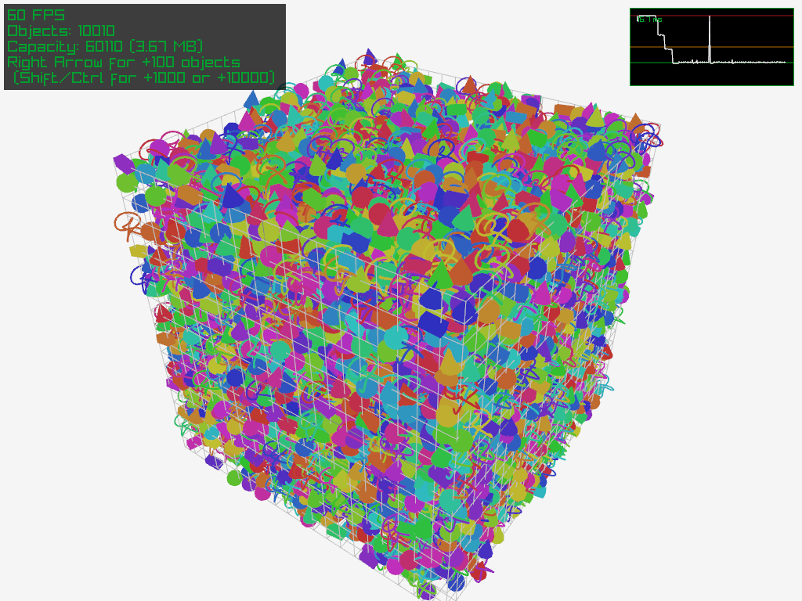
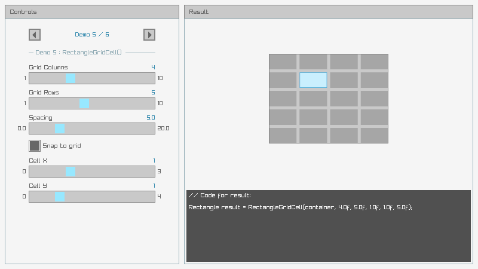
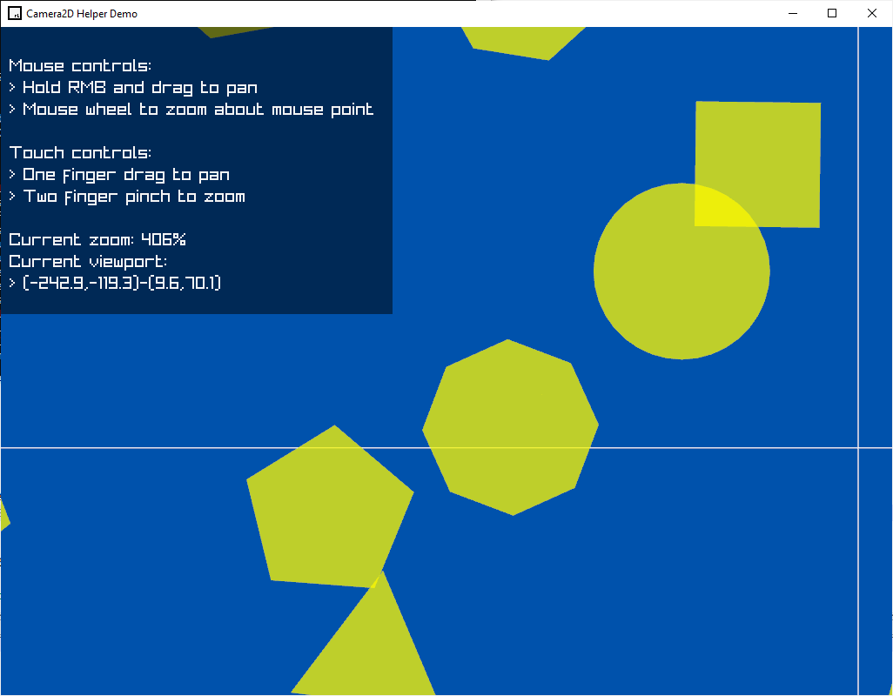

# raylib-quickies
A collection of single-header file libraries for raylib (C)

## mp_fps_tracker
Very quick and simple FPS tracker. Update and display in one call.

## mp_rects
Utility library for calculating rectangles. Inset, outset, grid layout, all that.
The demo showcases the functions visually.

## mp_camera2d
Simple library for managing 2d camera pan and zoom.
Handles mouse/keyboard as well as touch.

